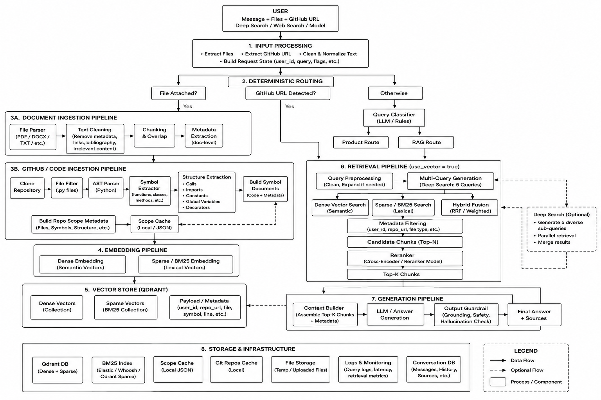

# AI Retrieval System
 **hybrid RAG and GitHub code-intelligence system** designed to answer questions from uploaded documents and GitHub repositories using deterministic routing, dense + sparse retrieval, reranking, and LLM-based answer generation.

## Architecture



## Core Features

* **Document RAG** — ingest PDFs, DOCX, TXT and other supported files.
* **Document cleaning** — removes unnecessary metadata, links, bibliography and irrelevant content before embedding.
* **Hybrid embeddings** — combines dense semantic embeddings with sparse/BM25 representations.
* **Hybrid retrieval** — combines semantic and lexical search for better recall.
* **Reranking** — reranks retrieved candidates before sending context to the LLM.
* **GitHub Code RAG** — clones repositories and analyzes Python source using AST parsing.
* **Symbol-level indexing** — indexes functions, classes and other code symbols instead of treating an entire repository as one document.
* **Code intelligence** — extracts calls, imports, constants, global variables, decorators and docstrings.
* **Repository scoping** — retrieves code using `user_id` and `repo_url` metadata.
* **Deep Search** — generates multiple sub-queries and performs retrieval for each query.
* **Output guardrails** — validates generated responses for grounding and hallucination.
* **Source attribution** — preserves document, file, symbol and line metadata for references.

## GitHub Ingestion

GitHub repositories follow a specialized pipeline:

```text
GitHub URL
    ↓
Clone Repository
    ↓
Filter Python Files
    ↓
AST Parsing
    ↓
Symbol Extraction
    ↓
Calls / Imports / Constants / Globals
    ↓
Build Symbol Documents
    ↓
Chunking
    ↓
Dense + Sparse Embeddings
    ↓
Qdrant
```

Repositories that have already been indexed for a user can be skipped to avoid unnecessary re-embedding.

## Retrieval

Every RAG request can use both:

```text
Dense Search → semantic similarity
BM25 Search  → exact/lexical matching
       ↓
Hybrid Fusion
       ↓
Reranking
       ↓
Top-K Context
```

This combination is particularly useful for code queries where exact identifiers such as function names, class names and variables are important.

## Deep Search

When enabled:

```text
User Query
    ↓
Generate 5 diverse queries
    ↓
Parallel Retrieval
    ↓
Hybrid Fusion
    ↓
Reranking
    ↓
Context Aggregation
    ↓
LLM
```

Deep Search is intended for complex questions where a single retrieval query may not provide sufficient coverage.

## Main Technologies

* Python
* FastAPI
* LangChain
* LangGraph
* Qdrant
* BM25 / Sparse Retrieval
* AST
* LLMs
* Dense Embeddings
* Hybrid Retrieval
* Reranking

## Design Philosophy

The system follows a **deterministic-first architecture**:

> Use deterministic logic whenever the decision can be made reliably; use LLM-based reasoning only where semantic understanding is required.

This reduces unnecessary LLM calls while keeping the retrieval pipeline flexible enough to handle complex document and code questions.
